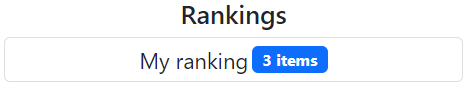

# Overview
This should serve as a tutorial on how to create itemlists for
[Fansort](https://floofnoodlecode.github.io/fansort/#/title?EOL=), an item sorter for user-defined itemlists.

This repository is also an itemlist collection that demonstrates all the features that you can use
for your custom itemlists. In order to see these features you can go to
https://floofnoodlecode.github.io/fansort/#/index/m8Q0jWF9Wk5-flpefn5KTmpyfkoq45q0xLzi_KIS3ZTU3HymJbmJmXkA?EOL=
to view the results.

Contents:
1. [Quickstart](#quickstart) - Teaches you the minimal information you need to know to create itemlists
2. [Reference](#reference) - Explains all the features that an itemlist can make use of

# Quickstart
This section will guide you through the process of creating a minimal itemlist from scratch. See the [Reference](#reference) section for in-depth detail of all the features.

## Setting up
We must first create a repository and obtain a Fansort link for our repo.

**Step 1**: Create a repository for your itemlist collection. I recommend naming it `fansort-*`, where `*` should be replaced with a name fitting for your collection.

**Step 2**: Create an `index.json` file into the root of the repo and add the following text to it:
```json
{
	"lists": []
}
```

**Step 3**: Copy your GitHub repository's URL.

**Step 4**: Go to the [Fansort Create page](https://floofnoodlecode.github.io/fansort/#/create?type=repo&EOL=)
and paste the copied URL into the first input box (*Root URL*)

**Step 5**: The app has generated the URL for your repo in the bottom text field.
It should look something like `https://floofnoodlecode.github.io/fansort/#/index/m8Q0jWF9Wk5-flpefn5KTmpyfkoq45q0xLzi_KIS3ZTU3HymJbmJmXkA?EOL=`.

**Step 6**: Go to that URL. It currently shows an empty page, since we still haven't added any itemlists.

Now that we have a fansort link, the changes that we will make in the repo will show up in the app (although it might take a few minutes).
Remember that if you want to visualize the changes after every step, you will need to **commit and push** the changes to
your repo and **refresh the app page**. You could also work locally by using any basic development server.
This is explained in the [Local development](#local-development) section.

## Creating the itemlist
We will finally create the itemlist and add a few items to it. The items will be text only.
In the next section we will add thumbnails for our items.

**Step 1**: Since a repository can contain multiple itemlists, it is a good idea to group into a common folder.
Create a folder named `lists` into the root of your repo.

**Step 2**: Inside the `lists` folder, create the folder in which the itemlist will reside.
I will just name it `programming-languages`.

**Step 3**: We need to add the itemlist folder to `index.json`. Modify `index.json` like this:
```json
{
	"lists": [
		"lists/programming-languages"
	]
}
```

**Step 4**: Inside `lists/programming-languages`, create a `manifest.json` file and add the following text to it:
```json
{
	"title": "Programming Languages"
}
```
`title` property is used as the default title for a new itemlist.

**Step 5**: Inside `lists/programming-languages`, create a `data.json` file and add the following text to it:
```json
{
	"items": [
		{
			"name": "Python"
		},
		{
			"name": "Javascript"
		},
		{
			"name": "Typescript"
		}
	]
}
```

Push the changes to the repo and refresh the app page. You should see that the index page now contains a link to your
`Programming Languages`. We will show how to make this page look prettier in the [index.liquid](#indexliquid) section. For now, click
the link to go to the itemlist page. You should see that it shows 3 items at the bottom the page,
their names corresponding to the `name` properties used in `data.json`. Click the blue **Start** button at the top
of the page to start sorting.

## Item thumbnails
First, let's download some images and put them in the itemlist folder. The path doesn't matter. You can find the images
in the `assets/` folder. Next, the `data.json` needs to be updated to specify the image corresponding to each item:
```json
{
	"items": [
		{
			"name": "Python",
			"props": {
				"img": "assets/python.png"
			}
		},
		{
			"name": "Javascript",
			"props": {
				"img": "assets/javascript.png"
			}
		},
		{
			"name": "Typescript",
			"props": {
				"img": "assets/typescript.png"
			}
		}
	]
}
```

The `props` property is used to specify arbitrary data for each item. This data will be available in the
[LiquidJS](https://liquidjs.com/index.html) template that we will create next.

Add a folder named `liquid` in the `lists/programming-languages` folder.
In this folder, create a `thumb.liquid` file and add the following text to it:
```xml
<image src="{{item.props.img}}" width="62" height="62"/>
```

The app renders this template for each item. The template will receive an `item` variable which contains the JSON object
corresponding to that item. Notice how the template uses `{{item.props.img}}` to decide the `src` dynamically.

Note that the rendered `thumb.liquid` is interpreted as an XML specific to Fansort.
In this case the `<image>` tag instructs the app to render the image given in `src`.
`width` and `height` specify the final width and height of the image, but they are optional.
More details in [thumb.liquid](#thumbliquid).

# Reference
## Generating a Fansort URL
The itemlist collection can be hosted either on github or on any webserver that allows [CORS](https://developer.mozilla.org/en-US/docs/Web/HTTP/CORS). To obtain a URL to your collection, you need to perform the following steps:

1. Go to the [Fansort Create page](https://floofnoodlecode.github.io/fansort/#/create?type=repo&EOL=) and paste the URL to the collection's index.json or its directory into the first input box (*Root URL*). Examples:
	- *GitHub repo*: https://github.com/floofnoodlecode/fansort-binding-of-isaac
	- *Server URL*: https://raw.githubusercontent.com/floofnoodlecode/fansort-binding-of-isaac/main/index.json
	- *Dev Server*: http://localhost:8080
2. The app has generated the URL for your repo in the bottom text field. Clicking on it should take you to the collection's index.

### Local development
You can use a local HTTP server to see your changes without pushing them to a public server.

I recommend using [Live Server](https://github.com/tapio/live-server#readme) because it also works
with the live reload feature described [below](#live-reload). Steps:
1. Install [node.js](https://nodejs.org/en/)
2. Open the terminal and install *Live Server*: `npm install -g live-server`
3. Go to your collection's root (the folder with `index.json`) and start the server: `live-server --cors`
4. Go to the [collection's URL](https://floofnoodlecode.github.io/fansort/#/index/m8S4LaOkpMBKXz8nPzkxJyO_uMTKwsDCQB8A?EOL=). This URL was generated from the *Fansort Create page* as described [above](#generating-a-fansort-url)

#### Live reload
Additionally, when using a local server hosted on `localhost` or `127.0.0.1`,
Fansort supports live reload using the following websocket `ws://<host>/ws`. Supported messages:
* `connected` : The server should send this message when the app connects to the websocket. Simply logs `Live reload connected` to console.
* `reload` : Reloads the current web page.
* Any other message logs an `Unknown message` error.

## Collection Index
### index.json
Every repository must contain at its root a file named `index.json` with the following schema:
```typescript
{
	"lists": string[] // Array of itemlist directories
}
```

The structure of itemlist directories is described in the [Itemlists](#itemlists) section.

### index.liquid
The index page can be customized using a template file located at `liquid/index.liquid`.
The template should output the desired HTML to display as the index page.

The template has access to the following variables:
```typescript
const lists: {
	id: string // Id that should be placed on an HTML element. The app adds an onclick event to that element that will change the URL to the itemlist page
	dir: string // Itemlist directory. It is guaranteed to end with a slash (/)
	title: string // Itemlist title, as given in the list's manifest
	props?: {[key: string]: any} // Itemlist props, as given in the list's manifest
}[]
```

## Itemlists
### manifest.json
Each itemlist must contain a `manifest.json` file in their respective directory. It has the following schema:
```typescript
{
	"title": string // Itemlist default title
	"props"?: {[key: string]: any} // Arbitrary object that gets passed to index.liquid template
}
```

The information from this file can be used in the [index.liquid](#index.liquid) template.

### data.json
Each itemlist must contain a `data.json` file in their respective directory. It has the following schema:
```typescript
{
	"items": ItemJSON[] // List of items
	"attrValuesOrder"?: {[key: string]: string[]} // Order of item attribute values
	"rankings"?: RankingJSON[] // Itemlist owner's rankings
	"sharedDataImports"?: {[key: string]: string} // Additional JSON files that the liquid templates will receive in an `shared` variable
}
```

Each property is described in detail below.

#### data.items
This property contains the data for each individual item.
It should contain a list of `ItemJSON` objects, where each object has the following schema:
```typescript
{
	"name": string // Item name. Must be unique.
	"attrs"?: {[key: string]: AttrValue | AttrValue[]} // Item attributes. Described below.
	"props"?: {[key: string]: any} // Arbitrary properties that get passed to templates
}
```

**IMPORTANT**: **If you want to update** an itemlist's data, there are a few rules that must be followed in order to not break existing URLs/rankings/states/etc.
That's because Fansort relies on the item indexes, not their names, to store the state/rankings/etc.
If an item is at position `i` in the `items` array, it must forever exist at that position.
This induces the following rules:
1. Never delete items. Any item's data (`name`, `attrs` and `props`), can be updated as you see fit but it should still represent the same item.
2. Never rearrange items in the array.
3. New items must only be added at the end of the array.

##### item.attrs
Items can define attributes, which enables filtering items by their attributes.


This feature is helpful when the list contains lots of items. `attrs` is an optional property.
If used, it must be an object where the keys represent the attribute names.
The values should be `AttrValue | AttrValue[]`, where `AttrValue = boolean | string`.
An array means that the item has multiple values for the given attribute.

#### data.attrValuesOrder
Optional attribute configuration. If `attrValuesOrder` is given, it must be an object where the keys represent the name
of the attributes given in `item.attrs` and the value is an array of strings.
The string indicate the order of the values in the filter selection dropdown.
By default, the values are sorted in alphabetical order.
If given, it must contain ALL possible string values that the attribute can take.

#### data.rankings
List of itemlist rankings to be displayed on the itemlist page.



`rankings` is an array of `RankingJSON`, where `RankingJSON` is an object that can be obtained from the Fansort app,
using *Export as... -> Ranking*.

#### data.sharedDataImports
`sharedDataImports` allows injecting additional data from JSON files into the templates.
The data will be injected in a `shared` variable, detailed in the [Templates](#templates) section.

The keys/values will be injected into `shared`, with the values replaced by the JSON data loaded from the specified file.

### Templates
The itemlist can contain a folder named `liquid` with the following template files:
- `thumb.liquid` - Outputs XML data, which serves as instructions to render each item thumbnail.
- `card.liquid` - Optional. Outputs arbitrary HTML data, used for rendering detailed data for each item

The itemlist templates receive the following variables:
```typescript
// Item data as given in `data.json`
const item: {
	name: string
	attrs?: {[key: string]: AttrValue | AttrValue[]}
	props?: {[key: string]: any}
}

// Shared data loaded using `data.sharedDataImports`
const shared: {[key: string]: any}
```

#### thumb.liquid
`thumb.liquid` needs to output XML data that instructs the app how to draw the thumbnail.
Currently it must be a single `<image>` tag with the following attributes:
- `src`: Path or URL to image source. Mandatory.
- `width`: The intrinsic width of the image in pixels. Must be an integer without a unit. Optional.
- `height`: The intrinsic height of the image, in pixels. Must be an integer without a unit. Optional.
- `pixelated`: Must be either `true` or `false`. If true, the image is drawn with a nearest neighbor interpolation. Default `false`.

If both `width` and `height` are missing, the source image's sizes are used.
If only one is missing, the missing one is computed such that the aspect ratio is maintained.

*Example*:
```xml
<image src="assets/thumb.png" width="78" pixelated="true">
```

#### card.liquid
Optional. Outputs arbitrary HTML data, used for rendering detailed data for each item.

## HTML Templates rules
The HTML that the templates output is post-processed before injecting it into the page:
1. Only certain tags and attributes are allowed. In general, everything that could execute javascript is removed. `<style>` tags are currently not allowed, but you can use `style` attributes. However, it is highly recommended to use [Bootstrap 5](https://getbootstrap.com/) classes instead. Aditionally, a `pixelated` class is available that modifies [`image-rendering`](https://developer.mozilla.org/en-US/docs/Web/CSS/image-rendering).
1. URLs that look like a path (e.g. *assets/image.png*) are changed to point to the repo. Relative paths assume that the current directory is the root directory when rendering *index.liquid* or the itemlist's directory when rendering *card.liquid*.
1. All links are made to open in a new tab/window.

Check out the developer tools console (F12 > Console tab) in the browser for errors related to template rendering.
